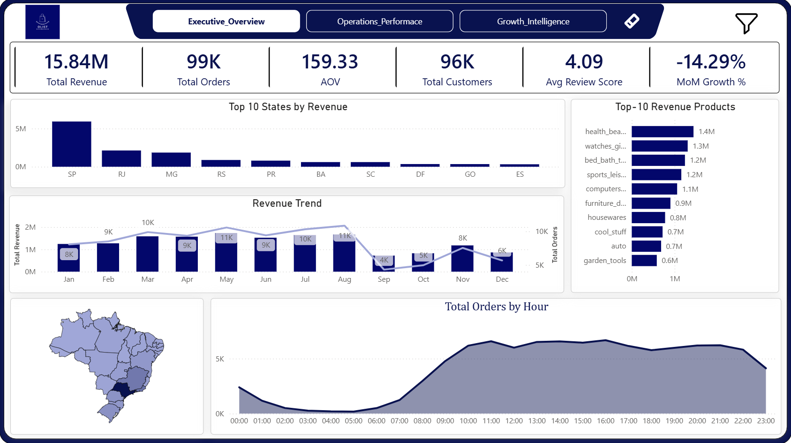
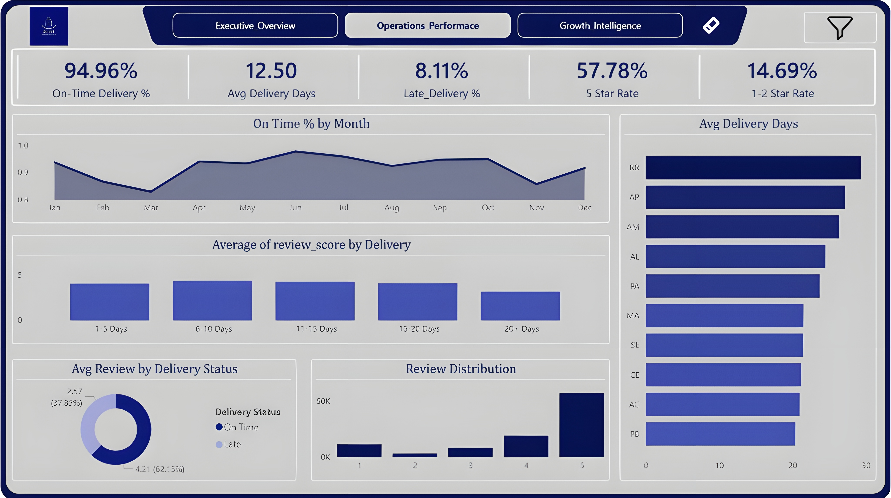
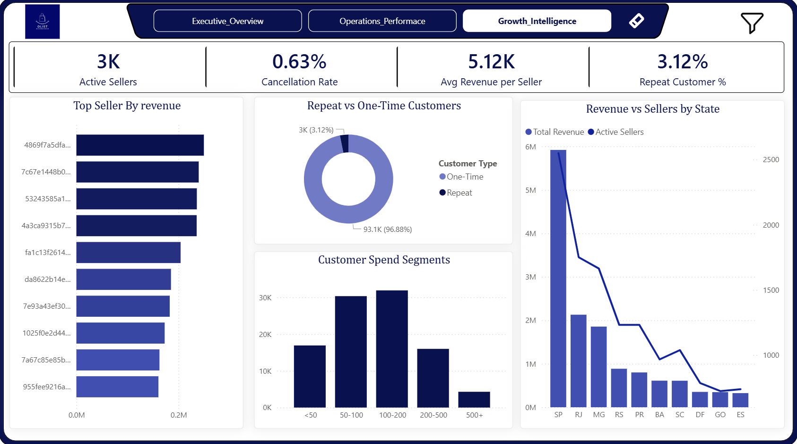

# 📊 Olist E-Commerce Analytics Dashboard

An end-to-end **Power BI Business Intelligence project** built using the Brazilian Olist e-commerce dataset.  
The dashboard analyzes **revenue performance, logistics efficiency, customer behavior, and seller contribution** to provide actionable business insights.
__________________________
🔗 Live Dashboard
[https://app.powerbi.com/view?r=XXXX](https://app.powerbi.com/view?r=eyJrIjoiMjIyYWM1MzYtY2I5MC00ODUyLWE5NjgtYTg2NzI2MjYzNzkxIiwidCI6IjE4MGU0OTAxLWVkZjktNDdhMC05NzU2LTA1OWJlMmZiMWNjMSJ9)

---

# 🧠 Business Problem

E-commerce companies generate massive operational and sales data but often lack centralized insights.

This project transforms raw transactional data into an **interactive decision-making dashboard** enabling stakeholders to monitor:

• Revenue growth  
• Customer retention  
• Delivery performance  
• Seller contributions  
• Operational efficiency  

---

# 🛠 Tools & Technologies

• Power BI  
• DAX (Data Analysis Expressions)  
• Power Query (ETL)  
• Data Modeling  
• GitHub (Project version control)

---

# 📈 Key KPIs

• **Total Revenue:** 15.84M  
• **Total Orders:** 99K  
• **Average Order Value (AOV):** 159.33  
• **Total Customers:** 96K  
• **Repeat Customer Rate:** ~3%  
• **Cancellation Rate:** ~0.63%

---

# 📊 Dashboard Pages

## 🏠 Home
Overview navigation page with animated entry and dashboard navigation.

---

## 📊 Executive Overview

High-level KPIs and revenue insights.

Features:
• Revenue trends  
• Payment method distribution  
• Top performing states  
• Top revenue products  

---

## ⚙️ Operations Performance

Analyzes delivery efficiency and logistics performance.

Features:
• On-time delivery rate  
• Late deliveries analysis  
• Delivery days by state  
• Customer review impact  

---

## 📈 Growth Intelligence

Customer behavior and revenue growth insights.

Features:
• Repeat vs one-time customers  
• Customer spend segmentation  
• Seller performance analysis  
• Revenue contribution by sellers  

---

# 🔍 Key Insights

✔ Revenue is concentrated among a small group of top sellers  
✔ Customer retention is relatively low (~3%) indicating growth opportunity  
✔ Delivery delays significantly impact review scores  
✔ Certain Brazilian states contribute disproportionately to revenue  

---

# 📂 Dataset

Dataset used: **Brazilian E-Commerce Public Dataset by Olist**

Source:  
https://www.kaggle.com/datasets/olistbr/brazilian-ecommerce

---

# 👨‍💻 Author

**Lohit Sai**  
Aspiring Data Analyst  

Skills:  
Power BI • SQL • Python • Data Visualization • Business Intelligence

---

# ⭐ If you like this project

Consider giving the repo a **star ⭐**
