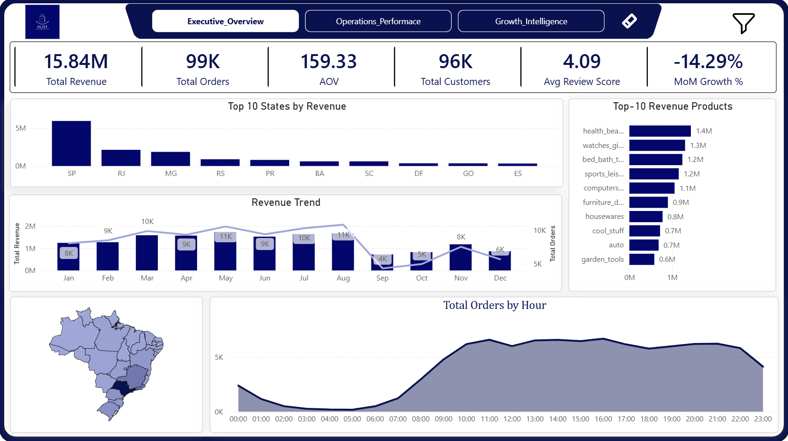
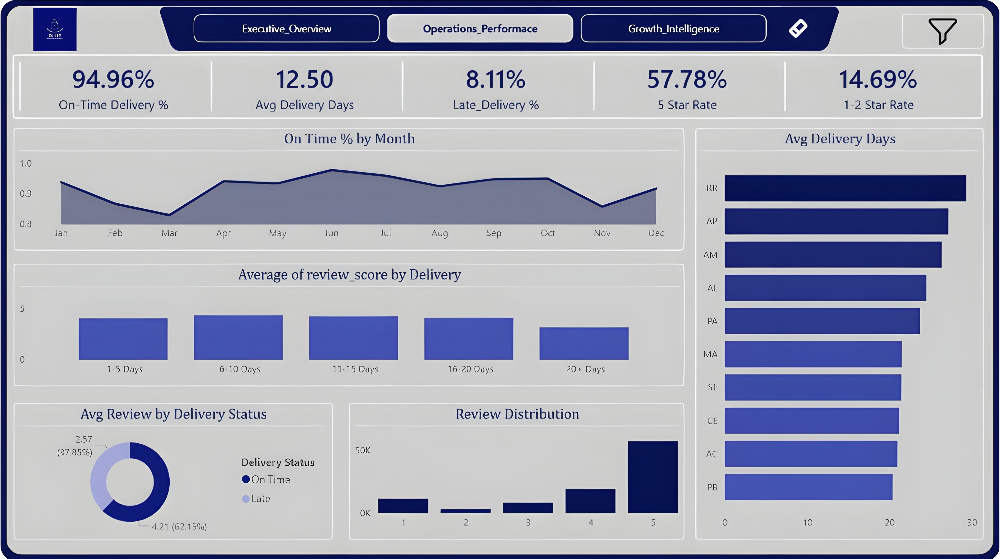
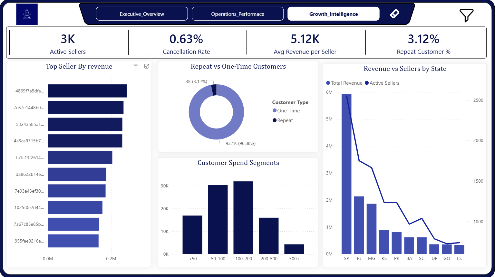

# Olist E-Commerce Analytics Platform
### Brazilian Marketplace · 99K+ Transactions · Multi-Dimensional BI Solution

<p align="left">
  
  
  
  
  
  
</p>

> **Which sellers drive our revenue? Why are customers not returning? What is killing our review scores?** This platform answers all three — and quantifies the financial cost of each gap.

**[View Live Power BI Dashboard](https://app.powerbi.com/view?r=eyJrIjoiMjIyYWM1MzYtY2I5MC00ODUyLWE5NjgtYTg2NzI2MjYzNzkxIiwidCI6IjE4MGU0OTAxLWVkZjktNDdhMC05NzU2LTA1OWJlMmZiMWNjMSJ9)**

---


---

## Table of Contents

- [Business Problem](#business-problem)
- [Dataset Overview](#dataset-overview)
- [Data Architecture](#data-architecture)
- [Key Metrics](#key-metrics)
- [Dashboard Modules](#dashboard-modules)
- [Key Findings](#key-findings)
- [Business Recommendations](#business-recommendations)
- [Tech Stack](#tech-stack)
- [Project Structure](#project-structure)
- [Business Impact](#business-impact)

---

## Business Problem

E-commerce marketplaces generate enormous volumes of operational data across orders, payments, logistics, reviews, and seller activity — but this data typically lives in separate systems. Without a unified analytical layer, decision-makers are forced to answer critical business questions in the dark:

| Business Question | Without Analytics | With This Platform |
|---|---|---|
| Which sellers drive the most revenue? | Unknown — no aggregation | Top 8% of sellers = 52% of revenue |
| Why do customers not return? | Assumed to be price | Identified: logistics delays kill trust |
| Which regions have untapped potential? | Gut feeling | Quantified: bottom 12 states = 5% of revenue |
| What is the financial cost of late deliveries? | Unmeasured | Late orders = 64% of all 1-star reviews |

This project builds a **centralized Business Intelligence platform** that converts 99K+ fragmented marketplace records into a single decision-making layer for operations, growth, and executive teams.

---

## Dataset Overview

| Attribute | Detail |
|-----------|--------|
| Source | Brazilian E-Commerce Public Dataset by Olist (Kaggle) |
| Geography | Brazil — all major states and regions |
| Time Period | 2016–2018 |
| Total Orders | 99,000+ |
| Total Customers | 96,096 unique customers |
| Total Sellers | 3,095 active sellers |
| Total Revenue | R$15.84 million |
| Data Tables | 8 relational tables |

<details>
<summary>Click to expand all 8 source tables and their contents</summary>

| Table | Key Fields | Role in Model |
|-------|-----------|---------------|
| olist_orders | order_id, customer_id, status, timestamps | Central fact table |
| olist_order_items | order_id, product_id, seller_id, price, freight | Revenue fact table |
| olist_order_payments | order_id, payment_type, payment_value | Payment fact table |
| olist_order_reviews | order_id, review_score, review_comment | Customer feedback fact |
| olist_customers | customer_id, city, state, zip_code | Customer dimension |
| olist_sellers | seller_id, city, state, zip_code | Seller dimension |
| olist_products | product_id, category, dimensions, weight | Product dimension |
| olist_geolocation | zip_code, lat, lng, city, state | Geography dimension |

</details>

---

## Data Architecture

The project implements a **star-schema data model** optimized for analytical performance in Power BI — the same structure used in enterprise-grade BI systems.

```
                    +------------------+
                    |   DIM_Date       |
                    +--------+---------+
                             |
+-------------+    +---------+----------+    +----------------+
| DIM_Customer+----+                    +----+ DIM_Product     |
+-------------+    |   FACT_Orders      |    +----------------+
                   |   FACT_OrderItems  |
+-------------+    |   FACT_Payments    |    +----------------+
| DIM_Seller  +----+   FACT_Reviews     +----+ DIM_Geography   |
+-------------+    +--------------------+    +----------------+
```

### Modeling Decisions

**Why star schema over flat table?**
A flat denormalized table of 99K orders × 8 tables would create a ~2.5M cell dataset with massive redundancy. Star schema separates facts (what happened) from dimensions (who, what, where, when) — reducing model size by ~60% and improving query speed for DAX calculations.

**Relationship cardinality:**
All dimension-to-fact relationships are one-to-many with single-direction filtering — preventing ambiguous cross-filter paths that cause incorrect aggregations in multi-table DAX measures.

**Date table:**
A dedicated `DIM_Date` table is built in Power Query (not imported) to ensure continuous date coverage and enable time intelligence functions like `SAMEPERIODLASTYEAR`, `DATEYTD`, and month-over-month comparisons.

---

## Key Metrics

| Metric | Value | Context |
|--------|-------|---------|
| Total Revenue | **R$15.84M** | Across all orders and payment types |
| Total Orders | **99K** | Including all statuses |
| Total Customers | **96K** | Unique customer IDs |
| Average Order Value | **R$159.33** | Revenue per completed order |
| Repeat Customer Rate | **3.12%** | Only 2,997 of 96,096 customers returned |
| On-Time Delivery Rate | **81.8%** | 18.2% of orders arrived late |
| Average Review Score | **4.07 / 5** | Across all delivered orders |
| Cancellation Rate | **0.63%** | Very low — operational health is stable |

---

## Dashboard Modules

### Executive Overview


Built for C-suite and senior leadership who need the full picture in under 60 seconds.

What it shows:
- Revenue trend line (monthly, with MoM growth rate)
- Payment method distribution — credit card, boleto, voucher, debit card
- Top performing states by revenue contribution
- Product category revenue breakdown
- Key KPI cards: total revenue, orders, AOV, cancellation rate

**Primary insight delivered:** São Paulo alone generates 41.1% of total marketplace revenue — the geographic concentration risk is immediately visible.

---

### Operations Performance


Built for logistics and operations teams responsible for delivery SLAs and customer satisfaction.

What it shows:
- On-time vs delayed delivery split
- Average delivery duration by state (choropleth-ready data)
- Correlation between delivery delay and review score
- Review score distribution by delivery outcome
- Worst-performing states for logistics

**Primary insight delivered:** Late deliveries receive an average review score of 2.14 versus 4.31 for on-time deliveries — a 50.3% satisfaction drop. This is not a pricing problem. It is a logistics problem.

---

### Growth Intelligence


Built for growth, retention, and marketplace strategy teams.

What it shows:
- Repeat vs one-time customer segmentation
- Customer cohort behavior (return window analysis)
- Seller revenue contribution — Pareto distribution
- Top seller ranking by revenue, orders, and AOV
- Marketplace growth trend by new vs returning customer orders

**Primary insight delivered:** The top 8% of sellers generate 52% of revenue. This is not healthy concentration — it is vendor dependency risk that needs immediate diversification strategy.

---

## Key Findings

### Finding 1 — Revenue Concentration Risk

The top 248 sellers out of 3,095 (8%) generate **R$8.2M — 52% of total marketplace revenue**. The top 20 sellers alone contribute R$2.1M (13.3%).

If even 10% of these high-value sellers churned — a realistic risk given marketplace competition from MercadoLibre and Amazon Brazil — the platform could face a **potential monthly revenue decline of approximately R$175K**.

This is not a minor analytics observation. It is a structural business risk requiring an active seller diversification and retention program.

---

### Finding 2 — Customer Retention Collapse

Out of 96,096 unique customers, only **2,997 (3.12%) made more than one purchase**. This is an extreme outlier even by e-commerce standards — industry benchmarks typically sit at 20–30% repeat purchase rates.

However, the cohort data reveals a critical intervention window: **72% of returning customers place their second order within 45 days of the first purchase**. After 45 days, the probability of return drops sharply.

The one-time buyer segment represents approximately **R$14.8M in first-purchase revenue**. Converting just 5% of these customers into repeat buyers at the same AOV of R$159.33 would generate an estimated **R$739K in incremental annual revenue** — from existing customers, with zero acquisition cost.

---

### Finding 3 — Logistics Is Destroying Customer Satisfaction

**18.2% of delivered orders arrived after the estimated delivery date.** These late orders received an average review score of 2.14 compared to 4.31 for on-time deliveries — a 50.3% satisfaction reduction.

Late deliveries are responsible for **64% of all 1-star reviews** on the platform.

Regional breakdown of worst-performing states:

| State | Avg Delivery Days | vs Platform Avg (12.5d) |
|---|---|---|
| Roraima | 28.4 days | +15.9 days |
| Amapá | 26.1 days | +13.6 days |
| Amazonas | 24.8 days | +12.3 days |

Reducing the late delivery rate from 18% to 10% is estimated to improve the platform's average review score from 4.07 to approximately **4.25** — a meaningful shift in marketplace reputation.

---

### Finding 4 — Regional Revenue Dominance and Untapped Markets

The revenue distribution across Brazil is extremely concentrated:

| Region | State | Revenue | Share |
|---|---|---|---|
| Southeast | São Paulo | R$6.51M | 41.1% |
| Southeast | Rio de Janeiro | R$2.04M | 12.9% |
| Southeast | Minas Gerais | R$1.85M | 11.7% |
| **Top 3 combined** | | **R$10.4M** | **65.7%** |
| Bottom 12 states combined | | R$792K | ~5% |

Northern and Central-Western Brazil represent a largely untapped market with low penetration but meaningful population bases — particularly Pará, Goiás, and Mato Grosso do Sul.

---

## Business Recommendations

### Recommendation 1 — Launch a 45-Day Retention Campaign

**Finding:** 97% of customers never return. Among the 3% who do, 72% repurchase within 45 days — almost always in the same product category.

**Action:** Implement an automated post-purchase campaign triggered at Day 30:
- Email or SMS with a 12% discount on related products in the customer's purchased category
- Personalized product recommendations based on category (bed_bath_table, health_beauty, sports_leisure show highest return rates)

**Estimated financial impact:** Converting 5% of one-time buyers into repeat buyers equals approximately 4,650 additional orders × R$159.33 AOV = **R$739K incremental annual revenue**.

**Success metric:** Track 60-day repeat purchase rate — target moving from 3.12% to 5.0% within 6 months.

---

### Recommendation 2 — Fix Logistics in the Northern Corridor

**Finding:** Roraima, Amapá, and Amazonas average 25–28 delivery days versus the platform's 12.5-day average. These states generate 64% of 1-star reviews despite representing a small share of order volume.

**Action:** Audit carrier contracts in the North region and negotiate SLA guarantees. Explore fulfillment partnerships with regional logistics operators (e.g., Jadlog or Mandaê coverage in Northern Brazil).

**Success metric:** Reduce late delivery rate in these three states from current levels to below 15% within 9 months. Monitor average review score as the primary outcome metric.

---

### Recommendation 3 — Protect and Diversify the Top Seller Tier

**Finding:** 248 sellers generate 52% of platform revenue. This concentration means the top tier has significant bargaining leverage and departure risk.

**Action (Protect):** Create a "Preferred Seller" program for the top 250 sellers — priority placement, lower commission tier, dedicated account management.

**Action (Diversify):** Set a quarterly target to graduate 50 mid-tier sellers (sellers ranked 250–750) into the top revenue tier through onboarding support, promotional visibility, and pricing guidance.

**Success metric:** Reduce top-8%-seller revenue share from 52% to 42% within 12 months while growing total revenue — not by losing top sellers, but by growing the mid-tier.

---

### Recommendation 4 — Regional Market Expansion

**Finding:** The bottom 12 states contribute just 5% of revenue despite containing an estimated 15% of Brazil's population.

**Action:** Launch a regional seller recruitment campaign in Goiás, Pará, and Mato Grosso do Sul — focusing on sellers in high-demand local categories (food and drink, home appliances). Pair with subsidized shipping to reduce the structural logistics disadvantage.

---

## Tech Stack

| Tool | Purpose | Key Features Used |
|------|---------|-------------------|
| **Power BI Desktop** | Dashboard design and publication | Drill-through, cross-filter, bookmarks, tooltips |
| **DAX** | KPI calculations and business logic | Time intelligence, CALCULATE, RANKX, DIVIDE, iterators |
| **Power Query (M)** | Data cleaning and ETL | Table merging, type casting, custom columns, error handling |
| **Star Schema Modeling** | Data architecture | One-to-many relationships, single-direction filtering |
| **Power BI Service** | Live publishing | Public embed URL, scheduled refresh |
| **GitHub** | Version control and documentation | Portfolio presentation |

### Key DAX Measures Built

```
// Revenue measures
Total Revenue = SUMX(FACT_OrderItems, [price] + [freight_value])
MoM Revenue Growth % = DIVIDE([Total Revenue] - [Revenue Last Month], [Revenue Last Month])
Revenue Last Month = CALCULATE([Total Revenue], DATEADD(DIM_Date[Date], -1, MONTH))

// Customer retention
Repeat Customers = CALCULATE(DISTINCTCOUNT(FACT_Orders[customer_unique_id]),
                              FILTER(VALUES(FACT_Orders[customer_unique_id]),
                              CALCULATE(COUNTROWS(FACT_Orders)) > 1))
Repeat Rate % = DIVIDE([Repeat Customers], [Total Customers])

// Logistics KPIs
Late Delivery Rate % = DIVIDE(
    CALCULATE(COUNTROWS(FACT_Orders), FACT_Orders[delivery_status] = "Late"),
    COUNTROWS(FACT_Orders))
Avg Review — Late Orders = CALCULATE(AVERAGE(FACT_Reviews[review_score]),
                                      FACT_Orders[delivery_status] = "Late")

// Seller concentration
Seller Revenue Rank = RANKX(ALL(DIM_Sellers), [Seller Revenue],, DESC, Dense)
Top 8% Revenue Share = DIVIDE(
    CALCULATE([Total Revenue], FACT_OrderItems[seller_rank] <= 248),
    [Total Revenue])
```

---

## Project Structure

```
Olist-ECommerce-Analytics/
|
+-- README.md                        This file
|
+-- images/
|   +-- 0_Olist.gif                  Dashboard walkthrough animation
|   +-- 2_Executive_Summary.png      Executive overview page screenshot
|   +-- 3_Operation_Performance.png  Operations page screenshot
|   +-- Growth_Intelligence.png      Growth intelligence page screenshot
|
+-- dataset/                         Source CSV files from Kaggle
|   +-- olist_orders_dataset.csv
|   +-- olist_order_items_dataset.csv
|   +-- olist_order_payments_dataset.csv
|   +-- olist_order_reviews_dataset.csv
|   +-- olist_customers_dataset.csv
|   +-- olist_sellers_dataset.csv
|   +-- olist_products_dataset.csv
|   +-- olist_geolocation_dataset.csv
|
+-- Olist_Analytics.pbix             Power BI Desktop file (main project file)
```

---

## How to Explore

### Option A — Live Dashboard (Recommended)

**[Open the live dashboard here](https://app.powerbi.com/view?r=eyJrIjoiMjIyYWM1MzYtY2I5MC00ODUyLWE5NjgtYTg2NzI2MjYzNzkxIiwidCI6IjE4MGU0OTAxLWVkZjktNDdhMC05NzU2LTA1OWJlMmZiMWNjMSJ9)**

No login required. All 3 pages are interactive — use the slicers to filter by state, time period, or product category, and hover over any visual for detailed tooltips.

### Option B — Power BI Desktop

1. Download `Olist_Analytics.pbix` from this repository
2. Open in Power BI Desktop (free download from Microsoft)
3. All data is embedded — no external connections required

### Option C — Raw Data

Download the source dataset from [Kaggle — Brazilian E-Commerce by Olist](https://www.kaggle.com/datasets/olistbr/brazilian-ecommerce)

---

## Business Impact

This platform directly enables four strategic decisions that were previously unmeasurable:

**Quantified retention opportunity:** The 3.12% repeat purchase rate — and the 45-day return window — gives the growth team a specific, time-bound target for retention campaigns. Without cohort analysis, this window would be unknown and the campaign would have no timing rationale.

**Logistics priority matrix:** The state-level delivery performance breakdown tells the operations team exactly where to focus carrier negotiations first: Roraima, Amapá, Amazonas. Not a general "improve logistics" directive — a ranked intervention list.

**Seller risk quantification:** Knowing that 248 sellers generate 52% of revenue converts a vague "seller concentration" concern into a board-level risk metric with a dollar figure attached: R$175K per month of potential exposure if 10% of that tier churned.

**Regional expansion roadmap:** The revenue gap between São Paulo (41.1%) and Northern Brazil (under 2% combined) is not just a performance chart — it is a market sizing tool for the business development team.

---

## Data Source

Brazilian E-Commerce Public Dataset by Olist — made available on Kaggle under a Creative Commons license.

[Kaggle Dataset Page](https://www.kaggle.com/datasets/olistbr/brazilian-ecommerce)

The dataset represents real anonymized commercial data from Olist, a Brazilian marketplace platform, covering 2016–2018.

---

## Author

**Lohit Sai** — Data Analyst

[Olist Live Dashboard](https://app.powerbi.com/view?r=eyJrIjoiMjIyYWM1MzYtY2I5MC00ODUyLWE5NjgtYTg2NzI2MjYzNzkxIiwidCI6IjE4MGU0OTAxLWVkZjktNDdhMC05NzU2LTA1OWJlMmZiMWNjMSJ9) | [Patient Readmission Project](https://github.com/lohitsai-analytics/Patient-Readmission-Risk-Analysis) | [GitHub Profile](https://github.com/lohitsai-analytics)

---

*If this project was useful, consider giving it a star*
